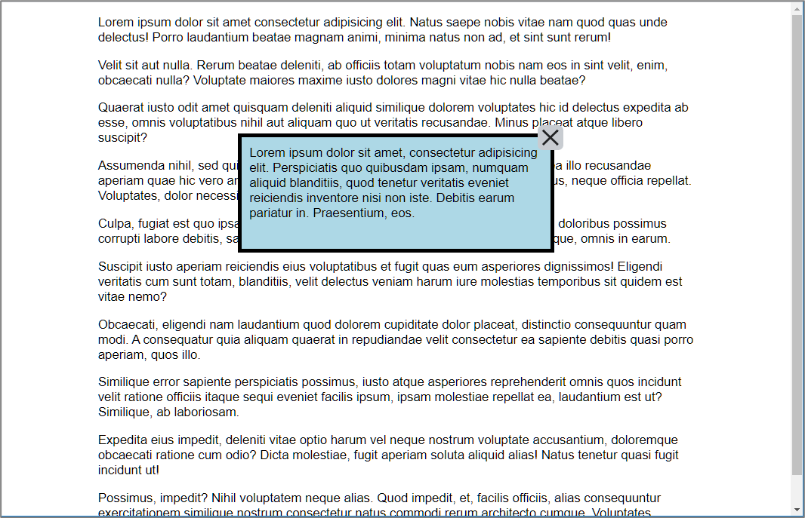

# Les 8 - Starter oefeningen Hoofdstuk 10: Lay-out - responsive - positionering

Download en unzip, of clone deze repository. Hiervoor klik je op de groene knop.

## Oefening 1 - Werelddelen (responsive Mobile first design)

- Open de map **oefening1**.

De header-, nav- en main-elementen op deze webpagina, hebben een vaste breedte van 1080 pixels. Hierdoor is deze webpagina niet geschikt voor weergave op een smartphone.

Voer onderstaande stappen uit om deze webpagina om te bouwen naar een 'responsive webpage'.

- We gaan werken volgens het 'Mobile First Design' concept. Plaats de CSS-regels die zorgen voor de page layout op een desktop in commentaar:
  
  ```
  header,
  nav,
  main {
    width: 1080px;
    margin-left: auto;
    margin-right: auto;
  }
  ```
- Simuleer, met behulp van de Chrome Developer Tools, hoe de webpagina eruit zal zien op een iPhone 5.
  
  
  
  Merk op dat daar sommige cellen in de tabel een vaste breedte hebben, de tabel te breed wordt weergeven. Plaats de CSS-declaraties die hiervoor zorgen in commentaar.
- Centreer de titel en de navigatie-hyperlinks.

  Te bekomen resultaat:

  

- Bekijk de webpagina in iPhone 5 weergave (Chrome Developer Tools). Centreer de tabel.
- Bekijk de webpagina terug met de Chrome Desktop browser. Maak het scherm smaller en terug breder. Als er 4 of 5 navigatie-hyperlinks naast elkaar komen te staan is dit niet echt mooi meer. Zorg er daarom voor dat de header-, nav- en main-elementen nooit breder kunnen worden dan 640 pixels, zo zijn we zeker dat er maximum drie navigatielinks naast elkaar komen te staan. 

  

- Ons ontwerp is nu bruikbaar bij verschillende vensterbreedtes, maar bij een gemaximaliseerd browservenster op een desktop zouden we graag terug 6 navigatielinks en 1080 pixels gebruiken voor de header-, nav- en main-elementen en een bredere tabel, zoals dit in het ontwerp waarvan we vertrokken zijn het geval was. Implementeer dit.<br>
  
  **Tips** Van zodra de layout viewport minimaal een breedte heeft van 1096 pixels (1080 pixels + twee marges van 8 pixels) moet je:
  - de breedte van header, nav en main terug instellen op 1080 pixels + de elementen centreren.
  - de tabel en de navigatie-hyperlinks terug links uitlijnen.
  - de oorspronkelijke tabelbreedtes terug instellen (zie starter).

Te bekomen resultaat op een desktop:


## Oefening 2 - Slavenhandel (responsive Mobile first design, floats, position)

- Open de map **oefening2**.
  
- Simuleer, met behulp van de Chrome Developer Tools, hoe de webpagina eruit zal zien op een iPhone 5.
- Voeg CSS toe zodat op een iPhone 5 de webpagina er als volgt uitziet. Hieronder vind je een aantal aanwijzingen/tips.
  
  

  **Aanwijzingen/tips:**

  
  - Geef de titel een donkergrijze onderrand (1 pixel) en stel de **font-family** in op **Georgia, serif**.
  - Stel voor de paragrafen:
    - de font-family in op sans-serif
    - de lettergrootte op 0,85 rem
    - en voorzie wat ademruimte tussen de regels door de regelhoogte in te stellen op 1,6
  - Voor het figure-element:
    - achtergrondkleur grijs (\#eee)
    - donkergrijze rand (1 pixel)
    - de witruimte tussen rand en afbeelding is 3 pixels
    - verwijder alle witruimte rond het figure-element
  - Voor het img-element:
    - donkergrijze rand (1pixel)
    - de afbeelding moet de volledige breedte innemen van zijn parent en automatisch breder en smaller worden als de vensterbreedte wijzigt (responsive image)

- Van zodra de afbeelding zijn volle breedte bereikt heeft, m.a.w.de layout viewport is breder dan 466 pixels (8px margin + 1px border + 3px padding + 448px + 3px + 1px + 8px), laat je de tekst rond het figure-element lopen. Maak eerst de afbeelding kleiner (320 pixels) zodat er ruimte is voor de tekst links van de afbeelding. Voorzie onder en links van het figure-element wat extra witruimte (0,75 rem).
  
- Op een desktop mag het main-element nooit breder worden dan 640 pixels en moet het element horizontaal gecentreerd worden.

Te bekomen resultaat:


- Verplaats in de titel de tekst "atlantische" 5 pixels naar beneden en 10 pixels naar links t.o.v. zijn positie in de "normal flow". Bovendien moet de tekst lichtgrijs worden weergegeven en achter de tekst "Trans-" geplaatst worden (zie onderstaande schermafbeelding).
 
- Zorg ervoor dat het h1-element steeds zichbaar blijft bovenaan de viewport als er naar beneden gescrold wordt (zie onderstaande schermafbeelding).


## Oefening 3 - Werelddelen (floats)

- Open de map **oefening3**.

Plaats in de desktop view de paragrafen en de tabellen naast elkaar door gebruik te maken van floats (zie onderstaande schermafbeelding). Hou hierbij rekening met het volgende:
- De breedte van de paragrafen is 55% van de breedte van het main-element. De 55% is inclusief een rechtse padding van 10 pixels.
- De breedte van de tabel is 45% van de breedte van het main-element.


***Opmerking*** Om twee elementen naar elkaar te plaatsen zijn er momenteel veel mogelijkheiden in CSS, in deze oefening hebben we hiervoor gebruikgemaakt van floats. Dit is een techniek die je (momenteel nog) op heel veel websites terugvindt. In de volgende lessen zullen we ook modernere technieken (flex en grid) zien om hetzelfde te bekomen.

## Oefening 4 - Dialog Box (position)

- Open de map **oefening4**.
- Positioneer de 'message box' in het midden van het main-element en op 150 pixels van de bovenkant van het main-element.
- Postioneer het svg-element 'close-button' rechtsboven in de 'message box'.

**Tip** Gebruik `position:absolute` voor het positioneren van de 'message box' en de 'close-button'.

Te bekomen resultaat:




